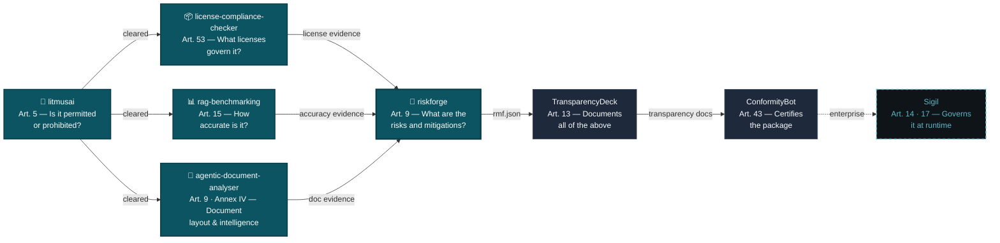

<!-- AiExponent LLC — Organization Profile · Caret identity (2026-06-11 rebrand, "One mark. Two accents.") -->
<div align="center">
  <a href="https://aiexponent.com">
    <picture>
      <source media="(prefers-color-scheme: dark)" srcset="https://raw.githubusercontent.com/aiexponent/.github/main/profile/brand/hero-banner-dark.png">
      <source media="(prefers-color-scheme: light)" srcset="https://raw.githubusercontent.com/aiexponent/.github/main/profile/brand/hero-banner-light.png">
      
    </picture>
  </a>
  <p>
    <a href="https://aiexponent.com"></a>
    <a href="https://pypi.org/org/AiExponent/"></a>
    
    
  </p>
</div>

---

## The Problem

The EU AI Act is not coming. **It is here.**

| Deadline | Status | Consequence |
|---|---|---|
| 2 Feb 2025 | ✅ Enforced | 8 AI practices are **illegal** (Art. 5). All deployers must evidence staff **AI literacy** proportionate to role and risk (Art. 4). Fines up to €35M. |
| 2 Aug 2025 | ✅ Enforced | GPAI model providers must publish technical documentation and training-data summaries (Art. 53). |
| 2 Aug 2026 | ⚠️ Active | Governance regime + **GPAI enforcement powers** take effect; member-state penalty regimes and notified-body provisions go live. |
| **2 Dec 2027** | 🕓 Provisional¹ | **High-risk** stand-alone systems (Annex III) need risk management, accuracy evidence, transparency docs (Arts. 9–15). Fines up to €15M or 3% of global turnover. |
| 2 Aug 2028 | 🕓 Provisional¹ | High-risk obligations extend to AI embedded in regulated products (Annex I): medical devices, machinery, vehicles, aviation, rail, maritime. |

<sup>¹ **Deferred** from 2 Aug 2026 / 2 Aug 2027 by the **Digital Omnibus** (Council–Parliament political agreement, 7 May 2026). The deferral is **provisional** — not yet adopted or published in the Official Journal (expected before 2 Aug 2026). Re-verify adoption status before relying on these dates. Sources: [Regulation (EU) 2024/1689](https://eur-lex.europa.eu/legal-content/EN/TXT/?uri=CELEX:32024R1689) · [Commission Digital Omnibus simplification package](https://digital-strategy.ec.europa.eu/en/policies/regulatory-framework-ai).</sup>

Most engineering teams cannot produce the required documentation. AiExponent builds the tools that change that — in 30 minutes, not 30 weeks.

### Executive Compliance Matrix

| EU AI Act Article | Status | Flagship Tool | What It Solves | Filing Output | Quick Install / Run |
|---|---|---|---|---|---|
| **Art. 5** (Prohibited AI) | ✅ Enforced | [`litmusai`](https://github.com/aiexponent/litmusai) | Pre-deployment screening for 8 prohibited practices | `SARIF`, `JSON` | `pip install litmus-screener` |
| **Art. 53** (GPAI & Models) | ✅ Enforced | [`license-compliance-checker`](https://github.com/aiexponent/license-compliance-checker) | Dependency & model license scanner; training data risk | `eu_ai_act_report.json`, SBOM | `pip install license-compliance-checker` |
| **Art. 15** (Accuracy & Robustness) | 🕓 2 Dec 2027¹ | [`rag-benchmarking`](https://github.com/aiexponent/rag-benchmarking) | Evaluation harness for RAG & agentic AI accuracy | `BenchmarkReport` JSON | `pip install rag-benchmarking` |
| **Art. 9** (Risk Management) | 🕓 2 Dec 2027¹ | [`riskforge`](https://github.com/aiexponent/riskforge) | Guided 8-dimension risk management system | Signed PDF, `rmf.json` | `pip install riskforge` |
| **Art. 9 & Annex IV** (Doc Intelligence) | 🕓 2 Dec 2027¹ | [`agentic-document-analyser`](https://github.com/aiexponent/agentic-document-analyser) | Multi-agent VLM document analysis & layout extraction | Structured `JSON`, Audit Blocks | `git clone` & `docker compose up` |

<sup>*Note: Article 4 (AI literacy) evidence generation is built directly into [RiskForge](https://github.com/aiexponent/riskforge).*</sup>

---

## Open Source Tools

Five production-ready tools. Each maps to an active enforcement obligation. Each produces a concrete artefact your legal team can file.

### [litmusai](https://github.com/aiexponent/litmusai) · Article 5

> *"Is my AI system even allowed — or does it touch a prohibited practice?"*

```bash
pip install litmus-screener
litmus screen --describe "a chatbot for mental-health support for teenagers"
```

Free, deterministic CLI screener for the **eight prohibited-practice categories** of Article 5. Per-category **Red / Amber / Clear** verdict with regulatory citations, confidence levels, and remediation — in under 60 seconds, fully offline.

**Output:** hash-verifiable report (JSON / SARIF / Markdown). Ships with the AiExponent reference ruleset — internal panel authored, **not yet lawyer-reviewed**; bring-your-own signed rulesets supported.

[](https://pypi.org/project/litmus-screener/)
[](https://github.com/aiexponent/litmusai/actions)

---

### [license-compliance-checker](https://github.com/aiexponent/license-compliance-checker) · Article 53

> *"Which licenses govern every component in my AI stack — including the models?"*

```bash
pip install license-compliance-checker
lcc scan . --policy eu-ai-act-compliance --format json
```

The only open-source scanner that combines dependency license detection, AI model license analysis (HuggingFace Hub API, GGUF, ONNX), and EU AI Act Article 53 compliance — in a single command.

**Output:** Article 53 compliance pack — `eu_ai_act_report.json` + CycloneDX SBOM + training data risk summary.

[](https://pypi.org/project/license-compliance-checker/)
[](https://github.com/aiexponent/license-compliance-checker/actions)

---

### [rag-benchmarking](https://github.com/aiexponent/rag-benchmarking) · Article 15

> *"Can I prove my RAG system is accurate enough to deploy? Can I show regulators the evidence?"*

```bash
pip install rag-benchmarking
# Plug in your LangChain, LlamaIndex, or custom pipeline
```

Framework-agnostic evaluation harness for RAG and agentic AI systems. 12 metrics across classic RAG, retrieval quality, and agentic-era evaluation. Measured faithfulness of **0.958** on the 50-sample golden dataset.

**Output:** `BenchmarkReport` JSON — audit-ready accuracy evidence for Article 15 compliance.

[](https://pypi.org/project/rag-benchmarking/)
[](https://github.com/aiexponent/rag-benchmarking/actions)

---

### [riskforge](https://github.com/aiexponent/riskforge) · Article 9

> *"Where is my Article 9 risk management file? How do I produce one before the high-risk deadline?"*

```bash
pip install riskforge
riskforge init --name "My AI System" --sys-version "1.0" \
  --purpose "..." --provider "MyOrg" --category essential_services
riskforge assess <system-id> --assessor-name "..." --assessor-role "..."
riskforge export <system-id> --format pdf
```

Guided 8-dimension risk assessment CLI with 50+ questions, Annex III pattern matching, SHA-256 hash-chained audit trail. Article 9 documentation in ~30 minutes.

**Output:** Signed PDF + `rmf.json` — Article 9 / Annex IV Risk Management File for regulator submission.

[](https://pypi.org/project/riskforge/)
[](https://github.com/aiexponent/riskforge/actions)

---

### [agentic-document-analyser](https://github.com/aiexponent/agentic-document-analyser) · Article 9 & Annex IV

> *"How do I automatically extract and verify compliance evidence from complex system documentation, PDFs, and architecture diagrams?"*

```bash
git clone https://github.com/aiexponent/agentic-document-analyser
cd agentic-document-analyser && docker compose up
```

High-throughput, multi-agent document intelligence engine for EU AI Act Article 9 risk management and Annex IV technical documentation. Leverages state-of-the-art Visual Language Models (VLMs) like Qwen2-VL to perform unified layout analysis, diagram parsing, OCR, and semantic understanding in a single pass ("Visual First, Text Second").

**Output:** Structured layout analysis (JSON), visual bounding-box audit blocks, and technical documentation risk reports.

[](https://github.com/aiexponent/agentic-document-analyser/blob/main/LICENSE)
[](https://github.com/aiexponent/agentic-document-analyser)
[](https://github.com/aiexponent/agentic-document-analyser)

---

## The Compound Moat

Upstream of everything, **LitmusAI** (Art. 5) is the go/no-go gate — screen for prohibited practices *before* you invest in compliance evidence. The four specialized tools below then form an integrated pipeline: each produces structured evidence consumed by the next, together covering the technical documentation required for high-risk AI system compliance.



**Solid teal fill** = open source, available now. **Dashed** = enterprise roadmap.

---

## Global Regulatory Coverage

Designed for the EU AI Act. Cross-mapped to every active framework:

| Framework | Status | Covered by |
|---|---|---|
| EU AI Act Art. 4 (AI literacy) | ✅ Enforced Feb 2025 | RiskForge |
| EU AI Act Art. 5 (prohibited practices) | ✅ Enforced 2 Feb 2025 | LitmusAI |
| EU AI Act Art. 53 (GPAI transparency) | ✅ Enforced 2 Aug 2025 | license-compliance-checker |
| EU AI Act Art. 9–15 (high-risk systems) | 🕓 2 Dec 2027 — provisional¹ | RiskForge, rag-benchmarking, agentic-document-analyser, license-compliance-checker |
| EU AI Act Annex IV (technical documentation) | 🕓 2 Dec 2027 — provisional¹ | agentic-document-analyser & RiskForge |
| EU AI Act Annex I (AI in regulated products) | 🕓 2 Aug 2028 — provisional¹ | Sectoral coverage |
| NIST AI RMF 1.0 | Active — US federal mandatory | RiskForge (cross-map built-in) |
| ISO/IEC 42001:2023 | Active — procurement gate | RiskForge (Annex A controls) |
| Colorado AI Act (SB 24-205, overhauled by SB 26-189) | Effective 1 Jan 2027² | RiskForge |
| Texas TRAIGA (HB 149) | Effective 1 Jan 2026 | RiskForge |

<sup>¹ Provisional under the Digital Omnibus — see note above. &nbsp; ² Colorado's original SB 24-205 (1 Feb 2026 start) was postponed, then substantially revised by **SB 26-189** (signed 14 May 2026), now effective **1 Jan 2027**. Texas's original HB 1709 was replaced in the enacted **TRAIGA (HB 149)**, effective **1 Jan 2026**.</sup>

---

## Enterprise: Sigil

Commercial AI agent governance platform. Real-time policy enforcement, audit logging, and compliance reporting for AI agents in production.

→ [aiexponent.com/products#sigil](https://aiexponent.com/products#sigil)

---

## Contributing

All tools are **Apache 2.0 licensed**. Contributions welcome.

The easiest contribution requires **zero Python** — add a risk question, a license pattern, or a benchmark metric by editing a YAML file. See `CONTRIBUTING.md` in each repository.

---

<div align="center">
  <sub>
    <a href="https://aiexponent.com">aiexponent.com</a> ·
    <a href="mailto:hello@aiexponent.com">hello@aiexponent.com</a> ·
    Built in the open · Apache 2.0
  </sub>
</div>
