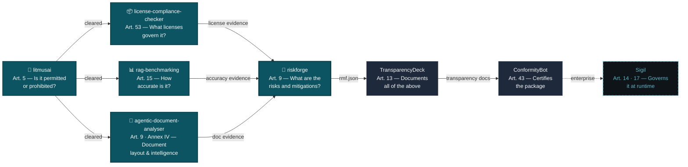

<!-- AiExponent LLC — Organization Profile · Caret identity (2026-06-11 rebrand, "One mark. Two accents.") -->
<div align="center">
  <a href="https://aiexponent.com">
    <picture>
      <source media="(prefers-color-scheme: dark)" srcset="https://raw.githubusercontent.com/aiexponent/.github/main/profile/brand/hero-banner-dark.png">
      <source media="(prefers-color-scheme: light)" srcset="https://raw.githubusercontent.com/aiexponent/.github/main/profile/brand/hero-banner-light.png">
      
    </picture>
  </a>
  <p>
    <a href="https://aiexponent.com"></a>
    <a href="https://pypi.org/org/AiExponent/"></a>
    <a href="https://github.com/aiexponent/.github/blob/main/LICENSE"></a>
    <a href="https://eur-lex.europa.eu/legal-content/EN/TXT/?uri=CELEX:32024R1689"></a>
  </p>
</div>

---

## The Problem

The EU AI Act is not coming. **It is here.**

| Deadline | Status | Consequence |
|---|---|---|
| 2 Feb 2025 | ✅ Enforced | 8 AI practices are **illegal** (Art. 5). All deployers must evidence staff **AI literacy** proportionate to role and risk (Art. 4). Fines up to €35M. |
| 2 Aug 2025 | ✅ Enforced | GPAI model providers must publish technical documentation and training-data summaries (Art. 53). |
| 2 Aug 2026 | ⚠️ Active | Governance regime + **GPAI enforcement powers** take effect; member-state penalty regimes and notified-body provisions go live. |
| **2 Dec 2027** | 🕓 Provisional¹ | **High-risk** stand-alone systems (Annex III) need risk management, accuracy evidence, transparency docs (Arts. 9–15). Fines up to €15M or 3% of global turnover. |
| 2 Aug 2028 | 🕓 Provisional¹ | High-risk obligations extend to AI embedded in regulated products (Annex I): medical devices, machinery, vehicles, aviation, rail, maritime. |

<sup>¹ **Deferred** from 2 Aug 2026 / 2 Aug 2027 by the **Digital Omnibus** (Council–Parliament political agreement, 7 May 2026). The deferral is **provisional** — not yet adopted or published in the Official Journal (expected before 2 Aug 2026). Re-verify adoption status before relying on these dates. Sources: [Regulation (EU) 2024/1689](https://eur-lex.europa.eu/legal-content/EN/TXT/?uri=CELEX:32024R1689) · [Commission Digital Omnibus simplification package](https://digital-strategy.ec.europa.eu/en/policies/regulatory-framework-ai).</sup>

Most engineering teams cannot produce the required documentation. AiExponent builds the tools that change that — in 30 minutes, not 30 weeks.

### Executive Compliance Matrix

| EU AI Act Article | Status | Flagship Tool | What It Solves | Filing Output | Quick Install / Run |
|---|---|---|---|---|---|
| **Art. 5** (Prohibited AI) | ✅ Enforced | [`litmusai`](https://github.com/aiexponent/litmusai) | Pre-deployment screening for 8 prohibited practices | `SARIF`, `JSON` | `pip install litmus-screener` |
| **Art. 53** (GPAI & Models) | ✅ Enforced | [`license-compliance-checker`](https://github.com/aiexponent/license-compliance-checker) | Dependency & model license scanner; training data risk | `eu_ai_act_report.json`, SBOM | `pip install license-compliance-checker` |
| **Art. 15** (Accuracy & Robustness) | 🕓 2 Dec 2027¹ | [`rag-benchmarking`](https://github.com/aiexponent/rag-benchmarking) | Evaluation harness for RAG & agentic AI accuracy | `BenchmarkReport` JSON | `pip install rag-benchmarking` |
| **Art. 9** (Risk Management) | 🕓 2 Dec 2027¹ | [`riskforge`](https://github.com/aiexponent/riskforge) | Guided 8-dimension risk management system | Signed PDF, `rmf.json` | `pip install riskforge` |
| **Art. 9 & Annex IV** (Doc Intelligence) | 🕓 2 Dec 2027¹ | [`agentic-document-analyser`](https://github.com/aiexponent/agentic-document-analyser) | Multi-agent VLM document analysis & layout extraction | Structured `JSON`, Audit Blocks | `git clone` & `docker compose up` |

<sup>*Note: Article 4 (AI literacy) evidence generation is built directly into [RiskForge](https://github.com/aiexponent/riskforge).*</sup>

---

## Open Source Tools

Five production-ready tools. Each maps to an active enforcement obligation. Each produces a concrete artefact your legal team can file.

### [litmusai](https://github.com/aiexponent/litmusai) · Article 5

> *"Is my AI system even allowed — or does it touch a prohibited practice?"*

```bash
pip install litmus-screener
litmus screen --describe "a chatbot for mental-health support for teenagers"
```

<p align="center">
  
</p>

Free, deterministic CLI screener for the **eight prohibited-practice categories** of Article 5. Per-category **Red / Amber / Clear** verdict with regulatory citations, confidence levels, and remediation — in under 60 seconds, fully offline.

**Output:** hash-verifiable report (JSON / SARIF / Markdown). Ships with the AiExponent reference ruleset — internal panel authored, **not yet lawyer-reviewed**; bring-your-own signed rulesets supported.

<details>
  <summary><b>🔍 Inspect Article 5 Screening Verdict (SARIF 2.1.0)</b></summary>

```json
{
  "$schema": "https://raw.githubusercontent.com/oasis-tcs/sarif-spec/main/sarif-2.1/schema/sarif-schema-2.1.0.json",
  "version": "2.1.0",
  "runs": [
    {
      "tool": {
        "driver": {
          "name": "LitmusAI",
          "version": "1.0.0",
          "rules": [
            {
              "id": "litmusai/5.1.b",
              "name": "Vulnerability Exploitation",
              "shortDescription": {
                "text": "Article 5(1)(b) Exploitation of age, disability, or specific social vulnerability"
              }
            }
          ]
        }
      },
      "results": [
        {
          "ruleId": "litmusai/5.1.b",
          "level": "warning",
          "message": {
            "text": "Conversational agent targets minors experiencing psychological distress without clinician escalation safeguards."
          },
          "properties": {
            "verdict": "amber",
            "confidence": 0.94,
            "legal_citation": "EU AI Act Art. 5(1)(b)",
            "triggered_rules": ["VULN-EXPLOIT-AGE-MINOR"]
          }
        }
      ],
      "properties": {
        "overall_verdict": "AMBER",
        "input_hash_sha256": "7f83b1657ff1fc53b92dc18148a1d65dfc2d4b1fa3d677284addd200126d9069"
      }
    }
  ]
}
```

<sub>📄 <a href="https://raw.githubusercontent.com/aiexponent/.github/main/profile/assets/artifacts/litmus-screening.sarif">Download Full SARIF Artifact</a> · 📂 <a href="https://github.com/aiexponent/litmusai/tree/main/examples">View litmusai Examples</a></sub>

</details>

[](https://pypi.org/project/litmus-screener/)
[](https://pypi.org/project/litmus-screener/)
[](https://pypi.org/project/litmus-screener/)
[](https://github.com/aiexponent/litmusai/actions/workflows/ci.yml)

---

### [license-compliance-checker](https://github.com/aiexponent/license-compliance-checker) · Article 53

> *"Which licenses govern every component in my AI stack — including the models?"*

```bash
pip install license-compliance-checker
lcc scan . --policy eu-ai-act-compliance --format json
```

<p align="center">
  
</p>

The only open-source scanner that combines dependency license detection, AI model license analysis (HuggingFace Hub API, GGUF, ONNX), and EU AI Act Article 53 compliance — in a single command.

**Output:** Article 53 compliance pack — `eu_ai_act_report.json` + CycloneDX SBOM + training data risk summary.

<details>
  <summary><b>🔍 Inspect Article 53 Compliance Pack (CycloneDX 1.5 + JSON)</b></summary>

```json
{
  "$schema": "https://cyclonedx.org/schema/bom-1.5.schema.json",
  "bomFormat": "CycloneDX",
  "specVersion": "1.5",
  "serialNumber": "urn:uuid:3e679927-2b59-4645-a7fb-7008779693bc",
  "metadata": {
    "timestamp": "2026-06-15T09:45:00Z",
    "tools": [
      {
        "vendor": "AiExponent",
        "name": "license-compliance-checker",
        "version": "1.4.2"
      }
    ]
  },
  "components": [
    {
      "type": "machine-learning-model",
      "name": "meta-llama/Llama-3-8B",
      "licenses": [
        {
          "license": {
            "id": "LicenseRef-Llama-3-Community"
          }
        }
      ],
      "properties": [
        { "name": "lcc:regulatory:framework", "value": "eu_ai_act" },
        { "name": "lcc:regulatory:risk_classification", "value": "general_purpose_ai" },
        { "name": "lcc:regulatory:eu_ai_act_article_53", "value": "applicable" },
        { "name": "lcc:regulatory:transparency_required", "value": "true" },
        { "name": "lcc:regulatory:copyright_compliance", "value": "documented" },
        { "name": "lcc:regulatory:training_data_sources", "value": "Common Crawl, RefinedWeb, StarCoder, Wikipedia" },
        { "name": "lcc:regulatory:use_restrictions", "value": "no-military, no-surveillance, high-risk-warning" }
      ]
    }
  ]
}
```

<sub>📄 <a href="https://raw.githubusercontent.com/aiexponent/.github/main/profile/assets/artifacts/license-compliance-cyclonedx.json">Download Full CycloneDX SBOM</a> · 📂 <a href="https://github.com/aiexponent/license-compliance-checker/blob/main/policy/templates/eu_ai_act.yaml">View LCC EU AI Act Policy Template</a></sub>

</details>

[](https://pypi.org/project/license-compliance-checker/)
[](https://pypi.org/project/license-compliance-checker/)
[](https://pypi.org/project/license-compliance-checker/)
[](https://github.com/aiexponent/license-compliance-checker/actions/workflows/ci.yml)

---

### [rag-benchmarking](https://github.com/aiexponent/rag-benchmarking) · Article 15

> *"Can I prove my RAG system is accurate enough to deploy? Can I show regulators the evidence?"*

```bash
pip install rag-benchmarking
# Plug in your LangChain, LlamaIndex, or custom pipeline
```

Framework-agnostic evaluation harness for RAG and agentic AI systems. 12 metrics across classic RAG, retrieval quality, and agentic-era evaluation. Measured faithfulness of **0.958** on the 50-sample golden dataset.

**Output:** `BenchmarkReport` JSON — audit-ready accuracy evidence for Article 15 compliance.

<details>
  <summary><b>🔍 Inspect Article 15 Accuracy & Robustness Evidence (JSON)</b></summary>

```json
{
  "$schema": "https://schemas.aiexponent.com/rag-benchmarking/v1/report.schema.json",
  "report_id": "rep_rag_20260615_7b3a9c",
  "pipeline_id": "enterprise-customer-rag-v2",
  "evaluated_at": "2026-06-15T10:30:00Z",
  "regulatory_mapping": {
    "framework": "EU AI Act",
    "article": "Article 15 (Accuracy, Robustness and Cybersecurity)",
    "verdict": "PASS"
  },
  "metrics": {
    "faithfulness": 0.958,
    "answer_relevance": 0.942,
    "context_recall": 0.915,
    "context_precision": 0.928,
    "hallucination_rate": 0.042,
    "robustness_score": 0.965,
    "latency_p95_ms": 240,
    "citation_precision": 0.978
  },
  "compliance_summary": {
    "status": "CONFORMING",
    "minimum_faithfulness_required": 0.900,
    "measured_faithfulness": 0.958,
    "audit_trail_signature": "sha256:d8a29b4e11c52b7a9e3d8f4c2e6b0a1f5c7e9d3b2a8f1e0c4b6d8a2f1e9c7b5a"
  }
}
```

<sub>📄 <a href="https://raw.githubusercontent.com/aiexponent/.github/main/profile/assets/artifacts/rag-benchmark-report.json">Download Full Benchmark Report</a> · 📂 <a href="https://github.com/aiexponent/rag-benchmarking/blob/main/data/golden/qa.jsonl">View 50-Sample Golden Dataset</a></sub>

</details>

[](https://pypi.org/project/rag-benchmarking/)
[](https://pypi.org/project/rag-benchmarking/)
[](https://pypi.org/project/rag-benchmarking/)
[](https://github.com/aiexponent/rag-benchmarking/actions/workflows/ci.yml)

---

### [riskforge](https://github.com/aiexponent/riskforge) · Article 9

> *"Where is my Article 9 risk management file? How do I produce one before the high-risk deadline?"*

```bash
pip install riskforge
riskforge init --name "My AI System" --sys-version "1.0" \
  --purpose "..." --provider "MyOrg" --category essential_services
riskforge assess <system-id> --assessor-name "..." --assessor-role "..."
riskforge export <system-id> --format pdf
```

<p align="center">
  
</p>

Guided 8-dimension risk assessment CLI with 50+ questions, Annex III pattern matching, SHA-256 hash-chained audit trail. Article 9 documentation in ~30 minutes.

**Output:** Signed PDF + `rmf.json` — Article 9 / Annex IV Risk Management File for regulator submission.

<details>
  <summary><b>🔍 Inspect Article 9 Risk Management File (rmf.json)</b></summary>

```json
{
  "$schema": "https://schemas.aiexponent.com/riskforge/rmf/v1.0.0",
  "id": "e9b271d4-8521-4f1a-9694-81d3d6e5a401",
  "rmf_schema_version": "1.0.0",
  "generated_at": "2026-06-15T11:00:00Z",
  "sha256_hash": "4e9a3b8d1f2c6e7a0b5d8f3e2a1c9b8d7e6f5a4b3c2d1e0f9a8b7c6d5e4f3a2b",
  "audit_entry_hash": "a7c8e9f0123456789abcdef0123456789abcdef0123456789abcdef012345678",
  "register": {
    "system": {
      "name": "Consumer Credit Eligibility Screener",
      "annex_iii_reference": "Annex III point 5(b) (Creditworthiness assessment)"
    },
    "dimension_summary": {
      "discrimination": { "residual_risk": "ACCEPTABLE" },
      "human_oversight": { "residual_risk": "LOW" },
      "data_governance": { "residual_risk": "LOW" },
      "transparency": { "residual_risk": "LOW" }
    }
  },
  "cross_references": [
    { "article_ref": "Art.9(2)(a)", "iso42001_ref": "Clause A.7", "nist_rmf_ref": "MEASURE 2.9" }
  ]
}
```

<sub>📄 <a href="https://raw.githubusercontent.com/aiexponent/.github/main/profile/assets/artifacts/riskforge-rmf.json">Download Full rmf.json Artifact</a> · 📂 <a href="https://github.com/aiexponent/riskforge/blob/main/examples/credit-scoring/expected.json">View RiskForge Credit Scoring RMF</a></sub>

</details>

[](https://pypi.org/project/riskforge/)
[](https://pypi.org/project/riskforge/)
[](https://pypi.org/project/riskforge/)
[](https://github.com/aiexponent/riskforge/actions/workflows/ci.yml)


---

### [agentic-document-analyser](https://github.com/aiexponent/agentic-document-analyser) · Article 9 & Annex IV

> *"How do I automatically extract and verify compliance evidence from complex system documentation, PDFs, and architecture diagrams?"*

```bash
git clone https://github.com/aiexponent/agentic-document-analyser
cd agentic-document-analyser && docker compose up
```

High-throughput, multi-agent document intelligence engine for EU AI Act Article 9 risk management and Annex IV technical documentation. Leverages state-of-the-art Visual Language Models (VLMs) like Qwen2-VL to perform unified layout analysis, diagram parsing, OCR, and semantic understanding in a single pass ("Visual First, Text Second").

**Output:** Structured layout analysis (JSON), visual bounding-box audit blocks, and technical documentation risk reports.

[](https://github.com/aiexponent/agentic-document-analyser/blob/main/LICENSE)
[](https://github.com/aiexponent/agentic-document-analyser)
[](https://github.com/aiexponent/agentic-document-analyser)

---

## The Compound Moat

Upstream of everything, **LitmusAI** (Art. 5) is the go/no-go gate — screen for prohibited practices *before* you invest in compliance evidence. The four specialized tools below then form an integrated pipeline: each produces structured evidence consumed by the next, together covering the technical documentation required for high-risk AI system compliance.



**Solid teal fill** = open source, available now. **Dashed** = enterprise roadmap.

---

## Global Regulatory Coverage

Designed for the EU AI Act. Cross-mapped to every active framework:

| Framework | Status | Covered by |
|---|---|---|
| EU AI Act Art. 4 (AI literacy) | ✅ Enforced Feb 2025 | RiskForge |
| EU AI Act Art. 5 (prohibited practices) | ✅ Enforced 2 Feb 2025 | LitmusAI |
| EU AI Act Art. 53 (GPAI transparency) | ✅ Enforced 2 Aug 2025 | license-compliance-checker |
| EU AI Act Art. 9–15 (high-risk systems) | 🕓 2 Dec 2027 — provisional¹ | RiskForge, rag-benchmarking, agentic-document-analyser, license-compliance-checker |
| EU AI Act Annex IV (technical documentation) | 🕓 2 Dec 2027 — provisional¹ | agentic-document-analyser & RiskForge |
| EU AI Act Annex I (AI in regulated products) | 🕓 2 Aug 2028 — provisional¹ | Sectoral coverage |
| NIST AI RMF 1.0 | Active — US federal mandatory | RiskForge (cross-map built-in) |
| ISO/IEC 42001:2023 | Active — procurement gate | RiskForge (Annex A controls) |
| Colorado AI Act (SB 24-205, overhauled by SB 26-189) | Effective 1 Jan 2027² | RiskForge |
| Texas TRAIGA (HB 149) | Effective 1 Jan 2026 | RiskForge |

<sup>¹ Provisional under the Digital Omnibus — see note above. &nbsp; ² Colorado's original SB 24-205 (1 Feb 2026 start) was postponed, then substantially revised by **SB 26-189** (signed 14 May 2026), now effective **1 Jan 2027**. Texas's original HB 1709 was replaced in the enacted **TRAIGA (HB 149)**, effective **1 Jan 2026**.</sup>

---

## Beyond Open Source: Enterprise & Advisory

> 💡 **Open-Source Guarantee**: All AiExponent CLI tools and screening engines (`litmusai`, `riskforge`, `license-compliance-checker`, `rag-benchmarking`, `agentic-document-analyser`) remain **100% free**, **Apache 2.0 licensed**, and operate strictly offline with **zero telemetry**. For enterprise production runtime enforcement and executive AI compliance advisory, we offer dedicated commercial platforms and bespoke strategic services:

| 🛡️ Sigil &mdash; Enterprise Runtime Platform | 👔 AiExponent Advisory &mdash; Executive Strategy |
| :--- | :--- |
| **Commercial AI Agent Governance & Observability**<br><br>While our open-source tools evaluate systems and licenses prior to deployment, **Sigil** enforces policy boundaries in live multi-agent production environments:<br><br>• **Real-Time Guardrails**: Dynamic interception of non-compliant autonomous agent actions & tool calls.<br>• **Cryptographic Audit Replay**: Tamper-evident execution logs satisfying EU AI Act Art. 12 & ISO 42001.<br>• **Continuous Drift & Risk Telemetry**: Automated alerts on safety posture and prompt degradation.<br>• **Article 14 Human-in-the-Loop**: Configurable escalation triggers and operational kill-switches.<br><br>[](https://aiexponent.com/products?utm_source=github&utm_medium=org_profile&utm_campaign=oss_funnel#sigil)<br>👉 [Explore Sigil on aiexponent.com →](https://aiexponent.com/products?utm_source=github&utm_medium=org_profile&utm_campaign=oss_funnel#sigil) | **Bespoke AI Compliance & Governance Consulting**<br><br>Strategic guidance for CISOs, General Counsel, and VP-level engineering leadership navigating mandatory global regulatory deadlines:<br><br>• **Executive Readiness Reviews**: Comprehensive gap analysis across EU AI Act, NIST AI RMF, and ISO 42001.<br>• **Annex III High-Risk Classification**: Authoritative scoping and risk classification audits.<br>• **Article 4 AI Literacy Programs**: Board- and engineering-level workforce certification curricula.<br>• **Conformity Assessment Roadmaps**: Fast-track documentation sprints for notified-body filing.<br><br>[](https://askajay.ai/?utm_source=github&utm_medium=org_profile&utm_campaign=oss_funnel)<br>👉 [Schedule an Advisory Session on AskAjay.ai →](https://askajay.ai/?utm_source=github&utm_medium=org_profile&utm_campaign=oss_funnel) |

---

## Contributing & Community

AiExponent is built in the open under the **Apache 2.0 License**. We welcome contributions from developers, AI safety researchers, compliance officers, and legal technologists.

### ⚡ 10-Minute Low-Code Contribution Pathways

You do not need to write Python code to contribute. AI compliance requires precise regulatory knowledge and real-world evaluation data. You can make an immediate impact by editing simple YAML or JSON files:

| Track | Target Tool | What You Contribute | Getting Started (< 10 Mins) |
| :--- | :--- | :--- | :--- |
| **Risk Question Bank** | [`riskforge`](https://github.com/aiexponent/riskforge) | Annex III risk questions, mitigations, ISO 42001 / NIST mappings | Add questions in [`src/riskforge/_data/question_bank/`](https://github.com/aiexponent/riskforge/tree/main/src/riskforge/_data/question_bank). |
| **License Policies** | [`license-compliance-checker`](https://github.com/aiexponent/license-compliance-checker) | Regulatory policy rules, RAIL patterns, open model licenses | Add policies in [`policy/templates/`](https://github.com/aiexponent/license-compliance-checker/tree/main/policy/templates). |
| **RAG Golden Datasets** | [`rag-benchmarking`](https://github.com/aiexponent/rag-benchmarking) | Domain question-context-answer ground-truth evaluation pairs | Add evaluation entries to [`data/golden/qa.jsonl`](https://github.com/aiexponent/rag-benchmarking/blob/main/data/golden/qa.jsonl). |
| **Prohibited Scenarios** | [`litmusai`](https://github.com/aiexponent/litmusai) | Article 5 screening edge cases and test portfolios | Add portfolio YAML fixtures to [`tests/fixtures/portfolio/`](https://github.com/aiexponent/litmusai/tree/main/tests/fixtures/portfolio). |

> 🏷️ **Looking for a starter issue?** Browse beginner-friendly tasks across the entire organization:  
> 👉 **[Explore "Good First Issues" Across AiExponent](https://github.com/search?q=org%3Aaiexponent+is%3Aissue+is%3Aopen+label%3A%22good+first+issue%22)**

---

### 🛡️ Community Health & Governance

| Document | Purpose & Scope | Direct Link |
| :--- | :--- | :--- |
| **Contributing Guide** | Development setup, conventional commits, and PR checklist | [`CONTRIBUTING.md`](https://github.com/aiexponent/.github/blob/main/CONTRIBUTING.md) |
| **Security Policy** | 48-hour SLA vulnerability reporting and coordinated disclosure | [`SECURITY.md`](https://github.com/aiexponent/.github/blob/main/SECURITY.md) |
| **Code of Conduct** | Contributor Covenant standards for welcoming and inclusive participation | [`CODE_OF_CONDUCT.md`](https://github.com/aiexponent/.github/blob/main/CODE_OF_CONDUCT.md) |
| **Open Source License** | Permissive Apache License 2.0 terms governing all repositories | [`LICENSE`](https://github.com/aiexponent/.github/blob/main/LICENSE) |

---

### 🔐 Coordinated Security Disclosure

AiExponent tools evaluate high-stakes regulatory compliance. If you discover a potential security vulnerability or algorithmic integrity issue:
- **Do NOT open a public GitHub issue or discussion.**
- Email our security engineering team directly at **[security@aiexponent.com](mailto:security@aiexponent.com)**.
- **SLA Commitment**: We acknowledge all reports within **48 hours** and provide a preliminary risk assessment within **5 business days**.
- Security researchers acting in good faith operate under full safe harbor. See our full [Security Policy](https://github.com/aiexponent/.github/blob/main/SECURITY.md) for details.

---

### 💬 Community & Discussions

Join fellow AI engineers, compliance architects, and security leads:
- 💬 **Technical Q&A & Proposals**: [litmusai GitHub Discussions](https://github.com/aiexponent/litmusai/discussions)
- 📧 **General Inquiries**: [hello@aiexponent.com](mailto:hello@aiexponent.com)

---

<div align="center">
  <sub>
    <a href="https://aiexponent.com">aiexponent.com</a> ·
    <a href="mailto:hello@aiexponent.com">hello@aiexponent.com</a> ·
    Built in the open · Apache 2.0
  </sub>
</div>
