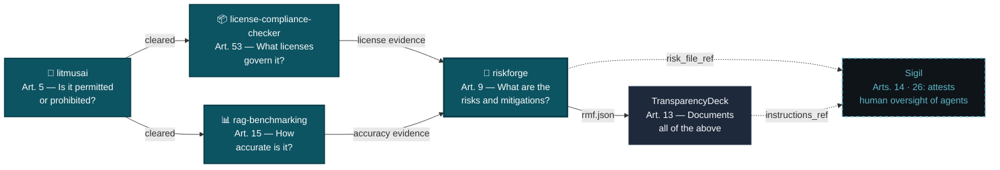

<!-- AiExponent LLC — Organization Profile · Caret identity (2026-06-11 rebrand, "One mark. Two accents.") -->
<div align="center">
  <a href="https://aiexponent.com">
    <picture>
      <source media="(prefers-color-scheme: dark)" srcset="https://raw.githubusercontent.com/aiexponent/.github/main/profile/brand/hero-banner-dark.png">
      <source media="(prefers-color-scheme: light)" srcset="https://raw.githubusercontent.com/aiexponent/.github/main/profile/brand/hero-banner-light.png">
      
    </picture>
  </a>
  <p>
    <a href="https://aiexponent.com"></a>
    <a href="https://pypi.org/org/AiExponent/"></a>
    <a href="https://github.com/aiexponent/.github/blob/main/LICENSE"></a>
    <a href="https://eur-lex.europa.eu/legal-content/EN/TXT/?uri=CELEX:32024R1689"></a>
  </p>
</div>

---

## The Problem

The EU AI Act is not coming. **It is here.**

| Deadline | Status | Consequence |
|---|---|---|
| 2 Feb 2025 | ✅ Enforced | 8 AI practices are **illegal** (Art. 5), with a further prohibition added on 2 Dec 2026, carrying fines up to €35M or 7% of global turnover (Art. 99(3)). All deployers must evidence staff **AI literacy** proportionate to role and risk (Art. 4), which carries no standalone penalty tier. |
| 2 Aug 2025 | ✅ Enforced | GPAI model providers must publish technical documentation and training-data summaries (Art. 53). |
| 2 Aug 2026 | ⚠️ Active | Governance regime + **GPAI enforcement powers** take effect; member-state penalty regimes and notified-body provisions go live. Art. 50(2) synthetic-content marking applies. |
| 2 Dec 2026 | 🕓 Upcoming | A **further prohibited practice** is added to Art. 5 (generation of non-consensual intimate imagery and CSAM). The Art. 50(2) grace period ends for systems placed on the market before 2 Aug 2026. |
| **2 Dec 2027** | 🕓 Deferred¹ | **High-risk** stand-alone systems (Annex III) need risk management, accuracy evidence, transparency docs (Arts. 9–15). Fines up to €15M or 3% of global turnover. |
| 2 Aug 2028 | 🕓 Deferred¹ | High-risk obligations extend to AI embedded in regulated products (Annex I): medical devices, machinery, vehicles, aviation, rail, maritime. |

<sup>¹ Deferred from 2 Aug 2026 / 2 Aug 2027 by the **Digital Omnibus on AI**, [Regulation (EU) 2026/1744](https://eur-lex.europa.eu/eli/reg/2026/1744/oj/eng) of 8 July 2026, published in the Official Journal on 24 July 2026 and in force since 27 July 2026. These are binding dates, not a proposal. Sources: [Regulation (EU) 2024/1689](https://eur-lex.europa.eu/legal-content/EN/TXT/?uri=CELEX:32024R1689) · [Regulation (EU) 2026/1744](https://eur-lex.europa.eu/eli/reg/2026/1744/oj/eng).</sup>

Most engineering teams cannot produce the required documentation. AiExponent builds the tools that change that — in 30 minutes, not 30 weeks.

### Executive Compliance Matrix

| EU AI Act Article | Status | Flagship Tool | What It Solves | Filing Output | Quick Install / Run |
|---|---|---|---|---|---|
| **Art. 5** (Prohibited AI) | ✅ Enforced | [`litmusai`](https://github.com/aiexponent/litmusai) | Pre-deployment screening for the Art. 5 prohibited practices | `SARIF`, `JSON` | `pip install litmus-screener` |
| **Art. 53** (GPAI & Models) | ✅ Enforced | [`license-compliance-checker`](https://github.com/aiexponent/license-compliance-checker) | Dependency & model license scanner; training data risk | `eu_ai_act_report.json`, SBOM | `pip install license-compliance-checker` |
| **Art. 15** (Accuracy & Robustness) | 🕓 2 Dec 2027¹ | [`rag-benchmarking`](https://github.com/aiexponent/rag-benchmarking) | Evaluation harness for RAG & agentic AI accuracy | `BenchmarkReport` JSON | `pip install rag-benchmarking` |
| **Art. 9** (Risk Management) | 🕓 2 Dec 2027¹ | [`riskforge`](https://github.com/aiexponent/riskforge) | Guided 8-dimension risk management system | Hash-chained PDF, `rmf.json` | `pip install riskforge` |

<sup>*Article 4 (AI literacy) evidence generation ships separately as OrgLiterate-T0, a committed build that has not yet been released.*</sup>

> ⚖️ **These are documentation tools, not legal advice.** AiExponent is not a notified body, and nothing here performs a conformity assessment. The tools generate structured evidence that a qualified reviewer, and ultimately your own counsel, has to check. Running them does not establish compliance with the EU AI Act or any other regulation, and the shipped rulesets and question banks have not been reviewed by external legal counsel.

---

## Open Source Tools

Four production-ready tools. Each maps to one EU AI Act obligation. Each produces a concrete artefact your legal team can file.

### [litmusai](https://github.com/aiexponent/litmusai) · Article 5

> *"Is my AI system even allowed — or does it touch a prohibited practice?"*

```bash
pip install litmus-screener
litmus screen --describe "a chatbot for mental-health support for teenagers"
```

<p align="center">
  
</p>

Free, deterministic CLI screener for the **eight prohibited-practice categories** of Article 5 as they stand today. Per-category **Red / Amber / Clear** verdict with regulatory citations, confidence levels and remediation, in under 60 seconds, fully offline. A further Art. 5 prohibition takes effect on 2 Dec 2026 and ships in ruleset v1.1.

**Output:** hash-verifiable report (JSON / SARIF / Markdown). Ships with the AiExponent reference ruleset — internal panel authored, **not yet lawyer-reviewed**; bring-your-own signed rulesets supported.

<details>
  <summary><b>🔍 Inspect Article 5 Screening Verdict (SARIF 2.1.0)</b></summary>

```json
{
  "$schema": "https://raw.githubusercontent.com/oasis-tcs/sarif-spec/main/sarif-2.1/schema/sarif-schema-2.1.0.json",
  "version": "2.1.0",
  "runs": [
    {
      "tool": {
        "driver": {
          "name": "LitmusAI",
          "version": "1.0.1",
          "informationUri": "https://aiexponent.com/products/litmusai",
          "rules": [
            {
              "id": "litmusai/5.1.b",
              "name": "Vulnerability Exploitation",
              "shortDescription": {
                "text": "Article 5.1.b screening"
              },
              "helpUri": "https://aiexponent.com/docs/litmusai/article-5#5.1.b"
            }
          ],
          "properties": {
            "ruleset_version": "ruleset-2024-1689-v1.0",
            "ruleset_provenance": "AiExponent Reference Ruleset ruleset-2024-1689-v1.0 (UNREVIEWED)"
          }
        }
      },
      "results": [
        {
          "ruleId": "litmusai/5.1.b",
          "level": "warning",
          "message": {
            "text": "Amber for Vulnerability Exploitation. Rules triggered: VULN-EXPLOIT-AGE-MINOR. Requires legal review before deployment."
          },
          "properties": {
            "verdict": "amber",
            "confidence": "high",
            "triggered_rules": ["VULN-EXPLOIT-AGE-MINOR"]
          }
        }
      ],
      "properties": {
        "overall_verdict": "amber",
        "input_hash_sha256": "7f83b1657ff1fc53b92dc18148a1d65dfc2d4b1fa3d677284addd200126d9069",
        "disclaimers": [
          "This is a screening tool, not legal advice.",
          "LitmusAI is not a notified body.",
          "Article 5 screening must be reviewed by qualified legal counsel.",
          "Screening does not confirm compliance with any other article of the EU AI Act.",
          "The ruleset is a good-faith interpretation of Regulation (EU) 2024/1689 and may not reflect the views of the European AI Office or national competent authorities."
        ]
      }
    }
  ]
}
```

<sub>📄 <a href="https://raw.githubusercontent.com/aiexponent/.github/main/profile/assets/artifacts/litmus-screening.sarif">Download Full SARIF Artifact</a> · 📂 <a href="https://github.com/aiexponent/litmusai/tree/main/examples">View litmusai Examples</a></sub>

</details>

[](https://pypi.org/project/litmus-screener/)
[](https://pypi.org/project/litmus-screener/)
[](https://pypi.org/project/litmus-screener/)
[](https://github.com/aiexponent/litmusai/actions/workflows/ci.yml)

---

### [license-compliance-checker](https://github.com/aiexponent/license-compliance-checker) · Article 53

> *"Which licenses govern every component in my AI stack — including the models?"*

```bash
pip install license-compliance-checker
lcc scan . --policy eu-ai-act-compliance --format json
```

<p align="center">
  
</p>

Combines dependency license detection, AI model license analysis (HuggingFace Hub API, GGUF, ONNX) and EU AI Act Article 53 reporting in a single command.

**Output:** Article 53 compliance pack — `eu_ai_act_report.json` + CycloneDX SBOM + training data risk summary.

<details>
  <summary><b>🔍 Inspect Article 53 Compliance Pack (CycloneDX 1.5 + JSON)</b></summary>

```json
{
  "$schema": "https://cyclonedx.org/schema/bom-1.5.schema.json",
  "bomFormat": "CycloneDX",
  "specVersion": "1.5",
  "serialNumber": "urn:uuid:3e679927-2b59-4645-a7fb-7008779693bc",
  "metadata": {
    "timestamp": "2026-06-15T09:45:00Z",
    "tools": [
      {
        "vendor": "AiExponent",
        "name": "license-compliance-checker",
        "version": "2.0.1"
      }
    ]
  },
  "components": [
    {
      "type": "machine-learning-model",
      "name": "meta-llama/Llama-3-8B",
      "licenses": [
        {
          "license": {
            "id": "LicenseRef-Llama-3-Community"
          }
        }
      ],
      "properties": [
        { "name": "lcc:regulatory:framework", "value": "eu_ai_act" },
        { "name": "lcc:regulatory:risk_classification", "value": "general_purpose_ai" },
        { "name": "lcc:regulatory:eu_ai_act_article_53", "value": "applicable" },
        { "name": "lcc:regulatory:transparency_required", "value": "true" },
        { "name": "lcc:regulatory:copyright_compliance", "value": "documented" },
        { "name": "lcc:regulatory:training_data_sources", "value": "Common Crawl, RefinedWeb, StarCoder, Wikipedia" },
        { "name": "lcc:regulatory:use_restrictions", "value": "no-military, no-surveillance, high-risk-warning" }
      ]
    }
  ]
}
```

<sub>📄 <a href="https://raw.githubusercontent.com/aiexponent/.github/main/profile/assets/artifacts/license-compliance-cyclonedx.json">Download Full CycloneDX SBOM</a> · 📂 <a href="https://github.com/aiexponent/license-compliance-checker/blob/main/policy/templates/eu_ai_act.yaml">View LCC EU AI Act Policy Template</a></sub>

</details>

[](https://pypi.org/project/license-compliance-checker/)
[](https://pypi.org/project/license-compliance-checker/)
[](https://pypi.org/project/license-compliance-checker/)
[](https://github.com/aiexponent/license-compliance-checker/actions/workflows/ci.yml)

---

### [rag-benchmarking](https://github.com/aiexponent/rag-benchmarking) · Article 15

> *"Can I prove my RAG system is accurate enough to deploy? Can I show regulators the evidence?"*

```bash
pip install rag-benchmarking
# Plug in your LangChain, LlamaIndex, or custom pipeline
```

Framework-agnostic evaluation harness for RAG and agentic AI systems, spanning classic RAG, retrieval quality and agentic-era evaluation. On the 50-sample golden dataset it measured faithfulness **0.958** and answer relevancy **0.810**, using `gemini-2.5-flash` as judge at temperature 0, with `all-MiniLM-L6-v2` embeddings for answer relevancy. Scores move with your judge model, embeddings, provider and pipeline.

**Output:** `BenchmarkReport` JSON, accuracy evidence you can attach to Article 15 documentation. It is a measurement, not a conformity assessment.

<details>
  <summary><b>🔍 Inspect a BenchmarkReport (JSON)</b></summary>

```json
{
  "run_id": "run_20260615_7b3a9c",
  "created_at": "2026-06-15T10:30:00Z",
  "n_samples": 50,
  "metrics": {
    "faithfulness": 0.958,
    "answer_relevancy": 0.810
  },
  "per_sample": [],
  "skipped_metrics": ["context_recall", "context_precision"],
  "skip_reasons": {
    "context_recall": "ground-truth contexts not supplied for this run",
    "context_precision": "ground-truth contexts not supplied for this run"
  },
  "config": {
    "metric_group": "classic",
    "judge_model": "gemini-2.5-flash",
    "judge_temperature": 0.0,
    "k": 5
  }
}
```

<sub>The harness reports measurements. It emits no verdict, no pass/fail label and no conformity determination: those are the assessor's job, not the tool's.</sub>

<sub>📄 <a href="https://raw.githubusercontent.com/aiexponent/.github/main/profile/assets/artifacts/rag-benchmark-report.json">Download Full Benchmark Report</a> · 📂 <a href="https://github.com/aiexponent/rag-benchmarking/blob/main/data/golden/qa.jsonl">View 50-Sample Golden Dataset</a></sub>

</details>

[](https://pypi.org/project/rag-benchmarking/)
[](https://pypi.org/project/rag-benchmarking/)
[](https://pypi.org/project/rag-benchmarking/)
[](https://github.com/aiexponent/rag-benchmarking/actions/workflows/ci.yml)

---

### [riskforge](https://github.com/aiexponent/riskforge) · Article 9

> *"Where is my Article 9 risk management file? How do I produce one before the high-risk deadline?"*

```bash
pip install riskforge
riskforge init --name "My AI System" --sys-version "1.0" \
  --purpose "..." --provider "MyOrg" --category essential_services
riskforge assess <system-id> --assessor-name "..." --assessor-role "..."
riskforge export <system-id> --format pdf
```

<p align="center">
  
</p>

Guided 8-dimension risk assessment CLI with 50+ questions, Annex III pattern matching, SHA-256 hash-chained audit trail. Article 9 documentation in ~30 minutes.

**Output:** hash-chained PDF with a named signer, plus `rmf.json`, forming an Article 9 risk management file. It is documentation you can file, not a conformity assessment.

<details>
  <summary><b>🔍 Inspect Article 9 Risk Management File (rmf.json)</b></summary>

```json
{
  "id": "e9b271d4-8521-4f1a-9694-81d3d6e5a401",
  "rmf_schema_version": "1.0.0",
  "generated_at": "2026-06-15T11:00:00Z",
  "sha256_hash": "4e9a3b8d1f2c6e7a0b5d8f3e2a1c9b8d7e6f5a4b3c2d1e0f9a8b7c6d5e4f3a2b",
  "signed_by": "r.okafor@example.com",
  "audit_entry_hash": "a7c8e9f0123456789abcdef0123456789abcdef0123456789abcdef012345678",
  "register": {
    "system": {
      "name": "Consumer Credit Eligibility Screener",
      "annex_iii_reference": "Annex III point 5(b) (Creditworthiness assessment)"
    },
    "dimension_summary": {
      "discrimination": { "residual_risk": "ACCEPTABLE" },
      "human_oversight": { "residual_risk": "LOW" },
      "data_governance": { "residual_risk": "LOW" },
      "transparency": { "residual_risk": "LOW" }
    }
  },
  "cross_references": [
    { "article_ref": "Art.9(2)(a)", "iso42001_ref": "Clause A.7", "nist_rmf_ref": "MEASURE 2.9" }
  ],
  "disclosure": "This document was produced using RiskForge v1.1.3, question bank version 1.0.0. It represents the team's documented risk assessment and has not been reviewed by a qualified legal professional. It does not constitute legal advice under the EU AI Act or any other regulation."
}
```

<sub>📄 <a href="https://raw.githubusercontent.com/aiexponent/.github/main/profile/assets/artifacts/riskforge-rmf.json">Download Full rmf.json Artifact</a> · 📂 <a href="https://github.com/aiexponent/riskforge/blob/main/examples/credit-scoring/expected.json">View RiskForge Credit Scoring RMF</a></sub>

</details>

[](https://pypi.org/project/riskforge/)
[](https://pypi.org/project/riskforge/)
[](https://pypi.org/project/riskforge/)
[](https://github.com/aiexponent/riskforge/actions/workflows/ci.yml)


---

## Experimental

Not production-ready, and not counted among the four tools above. Listed because the repository is public and the work is ongoing.

### [agentic-document-analyser](https://github.com/aiexponent/agentic-document-analyser) · Articles 11 & 19

> *"How do I extract and verify compliance evidence from complex system documentation, PDFs, and architecture diagrams?"*

```bash
git clone https://github.com/aiexponent/agentic-document-analyser
cd agentic-document-analyser && docker compose up
```

Multi-agent document intelligence engine targeting Article 11 technical documentation and Article 19 log preservation. Uses Visual Language Models such as Qwen2-VL for layout analysis, diagram parsing, OCR and semantic understanding in a single pass.

**Output:** Structured layout analysis (JSON), visual bounding-box audit blocks, and technical documentation risk reports.

**Status: alpha.** No authentication, no offline inference, and a hosted-inference dependency. Do not point it at production or confidential documents.

[](https://github.com/aiexponent/agentic-document-analyser/blob/main/LICENSE)
[](https://github.com/aiexponent/agentic-document-analyser)
[](https://github.com/aiexponent/agentic-document-analyser)

---

<div align="center">

<h3>🔌 Ecosystem Compatibility & Integrations</h3>
<p><sub>INTEGRATES SEAMLESSLY WITH YOUR PRODUCTION AI & COMPLIANCE STACK</sub></p>

<p>
  <a href="https://www.langchain.com"></a>
  <a href="https://www.llamaindex.ai"></a>
  <a href="https://huggingface.co"></a>
  <a href="https://github.com/ggerganov/ggml"></a>
  <a href="https://onnxruntime.ai"></a>
</p>
<p>
  <a href="https://cyclonedx.org"></a>
  <a href="https://spdx.dev"></a>
  <a href="https://sarifweb.azurewebsites.net"></a>
  <a href="https://www.docker.com"></a>
  <a href="https://www.nist.gov/itl/ai-risk-management-framework"></a>
  <a href="https://www.iso.org/standard/81230.html"></a>
</p>

</div>

---

## The Compound Moat

Upstream of everything, **LitmusAI** (Art. 5) is the go/no-go gate: screen for prohibited practices *before* you invest in compliance evidence. The three evidence tools below then form an integrated pipeline, each producing structured evidence consumed by the next. Together they cover Articles 5, 9, 15 and 53. They do not cover the whole of Annex IV, and Articles 10, 14 and 72 need evidence these four tools do not produce.


```mermaid
graph LR
    LIT["🚦 litmusai\nArt. 5 — Is it permitted\nor prohibited?"]
    LCC["📦 license-compliance-checker\nArt. 53 — What licenses\ngovern it?"]
    RAG["📊 rag-benchmarking\nArt. 15 — How\naccurate is it?"]
    RF["🔐 riskforge\nArt. 9 — What are the\nrisks and mitigations?"]
    TD["TransparencyDeck\nArt. 13 — Documents\nall of the above"]
    SIG["Sigil\nArts. 14 · 26: attests\nhuman oversight of agents"]

    LIT -->|"cleared"| LCC
    LIT -->|"cleared"| RAG
    LCC -->|"license evidence"| RF
    RAG -->|"accuracy evidence"| RF
    RF -->|"rmf.json"| TD
    RF -.->|"risk_file_ref"| SIG
    TD -.->|"instructions_ref"| SIG

    style LIT fill:#0D5463,color:#FCFCFA,stroke:#093E49,stroke-width:2px
    style LCC fill:#0D5463,color:#FCFCFA,stroke:#093E49,stroke-width:2px
    style RAG fill:#0D5463,color:#FCFCFA,stroke:#093E49,stroke-width:2px
    style RF fill:#0D5463,color:#FCFCFA,stroke:#093E49,stroke-width:3px
    style TD fill:#1E293B,color:#F8FAFC,stroke:#334155,stroke-width:1px
    style SIG fill:#0F1419,color:#5DB7C8,stroke:#5DB7C8,stroke-width:2px,stroke-dasharray:5 5
```

**Solid teal fill** = open source, available now. **Dark fill** = roadmap, adoption-gated. **Dashed border** = committed build, not yet released.

---

## Global Regulatory Coverage

Designed for the EU AI Act. Cross-mapped to every active framework:

| Framework | Status | Covered by |
|---|---|---|
| EU AI Act Art. 4 (AI literacy) | ✅ Enforced 2 Feb 2025 | OrgLiterate-T0 (not yet released) |
| EU AI Act Art. 5 (prohibited practices) | ✅ Enforced 2 Feb 2025 | LitmusAI |
| EU AI Act Art. 53 (GPAI transparency) | ✅ Enforced 2 Aug 2025 | license-compliance-checker |
| EU AI Act Art. 9–15 (high-risk systems) | 🕓 Deferred to 2 Dec 2027¹ | RiskForge, rag-benchmarking, license-compliance-checker |
| EU AI Act Annex IV (technical documentation) | 🕓 Deferred to 2 Dec 2027¹ | RiskForge |
| EU AI Act Annex I (AI in regulated products) | 🕓 Deferred to 2 Aug 2028¹ | Sectoral coverage |
| NIST AI RMF 1.0 | Voluntary framework | RiskForge (cross-map built-in) |
| ISO/IEC 42001:2023 | Certifiable management-system standard | RiskForge (Annex A control cross-map) |
| Colorado AI Act (SB 24-205, repealed and reenacted by SB 26-189) | Effective 1 Jan 2027² | Partial. RiskForge documents risk; it does not produce the notice, disclosure or human-review records the statute requires |
| Texas TRAIGA (HB 149) | Effective 1 Jan 2026 | None today. TRAIGA is a prohibited-use list, closer in structure to LitmusAI than to RiskForge, but no TRAIGA ruleset ships: LitmusAI's only ruleset is EU-only |

<sup>¹ Deferred by the Digital Omnibus on AI, Regulation (EU) 2026/1744, in force since 27 July 2026. See the note above. &nbsp; ² Colorado's original SB 24-205 (1 Feb 2026 start) was postponed, then repealed and reenacted as **SB 26-189** (signed 14 May 2026), now effective **1 Jan 2027**. Texas's original HB 1709 was replaced in the enacted **TRAIGA (HB 149)**, effective **1 Jan 2026**.</sup>

---

## Beyond the CLIs: Attestation & Advisory

> 💡 **Open-Source Guarantee**: All four production CLI tools (`litmusai`, `riskforge`, `license-compliance-checker`, `rag-benchmarking`) remain **100% free**, **Apache 2.0 licensed**, and send **zero telemetry**. On network use they differ: `litmusai` and `riskforge` run fully offline, `license-compliance-checker` queries OSV, ClearlyDefined, GitHub and the Hugging Face Hub to resolve licenses, and `rag-benchmarking` calls whichever LLM you configure as its judge. Sigil will ship on the same terms. Executive AI compliance advisory is the one paid offering below:

| 🛡️ Sigil &mdash; Agent Oversight Attestation | 👔 AiExponent Advisory &mdash; Executive Strategy |
| :--- | :--- |
| **Free, open-source attestation for agent oversight**<br><br>Sigil reads the audit and trace exports your gateway, observability stack and identity provider already produce, then emits the evidence an examiner asks for. It never intercepts, blocks or proxies an agent action.<br><br>• **`sigil ingest`**: read existing audit and trace exports.<br>• **`sigil attest`**: emit an Agent Register and Oversight Log as hash-chained JSON plus PDF, every field cross-referenced to EU AI Act Arts. 14 and 26.<br>• **`sigil drill`**: record a kill-switch test as a signed result with named operator, time-to-stop and outcome.<br>• **`sigil verify`**: recompute the chain.<br><br>Apache 2.0, runs local, zero telemetry. Regulator-plural: EU Arts. 14 and 26 form the spine, with CBUAE, DIFC, NCA AICG-1, SDAIA and IMDA as cross-reference columns.<br><br>**v0.1 is targeted for October 2026 and has not been released.**<br><br>[](https://github.com/aiexponent)<br>👉 Watch this organisation to be notified when v0.1 lands. | **Bespoke AI Compliance & Governance Consulting**<br><br>Strategic guidance for CISOs, General Counsel, and VP-level engineering leadership navigating mandatory global regulatory deadlines:<br><br>• **Executive Readiness Reviews**: Comprehensive gap analysis across EU AI Act, NIST AI RMF, and ISO 42001.<br>• **Annex III High-Risk Classification**: Authoritative scoping and risk classification audits.<br>• **Article 4 AI Literacy Programs**: Board- and engineering-level workforce certification curricula.<br>• **Conformity Assessment Roadmaps**: Fast-track documentation sprints for notified-body filing.<br><br>[](https://askajay.ai/?utm_source=github&utm_medium=org_profile&utm_campaign=oss_funnel)<br>👉 [Schedule an Advisory Session on AskAjay.ai →](https://askajay.ai/?utm_source=github&utm_medium=org_profile&utm_campaign=oss_funnel) |

---

## Contributing & Community

AiExponent is built in the open under the **Apache 2.0 License**. We welcome contributions from developers, AI safety researchers, compliance officers, and legal technologists.

### ⚡ 10-Minute Low-Code Contribution Pathways

You do not need to write Python code to contribute. AI compliance requires precise regulatory knowledge and real-world evaluation data. You can make an immediate impact by editing simple YAML or JSON files:

| Track | Target Tool | What You Contribute | Getting Started (< 10 Mins) |
| :--- | :--- | :--- | :--- |
| **Risk Question Bank** | [`riskforge`](https://github.com/aiexponent/riskforge) | Annex III risk questions, mitigations, ISO 42001 / NIST mappings | Add questions in [`src/riskforge/_data/question_bank/`](https://github.com/aiexponent/riskforge/tree/main/src/riskforge/_data/question_bank). |
| **License Policies** | [`license-compliance-checker`](https://github.com/aiexponent/license-compliance-checker) | Regulatory policy rules, RAIL patterns, open model licenses | Add policies in [`policy/templates/`](https://github.com/aiexponent/license-compliance-checker/tree/main/policy/templates). |
| **RAG Golden Datasets** | [`rag-benchmarking`](https://github.com/aiexponent/rag-benchmarking) | Domain question-context-answer ground-truth evaluation pairs | Add evaluation entries to [`data/golden/qa.jsonl`](https://github.com/aiexponent/rag-benchmarking/blob/main/data/golden/qa.jsonl). |
| **Prohibited Scenarios** | [`litmusai`](https://github.com/aiexponent/litmusai) | Article 5 screening edge cases and test portfolios | Add portfolio YAML fixtures to [`tests/fixtures/portfolio/`](https://github.com/aiexponent/litmusai/tree/main/tests/fixtures/portfolio). |

> 🏷️ **Looking for a starter issue?** Browse beginner-friendly tasks across the entire organization:  
> 👉 **[Explore "Good First Issues" Across AiExponent](https://github.com/search?q=org%3Aaiexponent+is%3Aissue+is%3Aopen+label%3A%22good+first+issue%22)**

---

### 🛡️ Community Health & Governance

| Document | Purpose & Scope | Direct Link |
| :--- | :--- | :--- |
| **Contributing Guide** | Development setup, conventional commits, and PR checklist | [`CONTRIBUTING.md`](https://github.com/aiexponent/.github/blob/main/CONTRIBUTING.md) |
| **Security Policy** | 48-hour SLA vulnerability reporting and coordinated disclosure | [`SECURITY.md`](https://github.com/aiexponent/.github/blob/main/SECURITY.md) |
| **Code of Conduct** | Contributor Covenant standards for welcoming and inclusive participation | [`CODE_OF_CONDUCT.md`](https://github.com/aiexponent/.github/blob/main/CODE_OF_CONDUCT.md) |
| **Open Source License** | Permissive Apache License 2.0 terms governing all repositories | [`LICENSE`](https://github.com/aiexponent/.github/blob/main/LICENSE) |

---

### 🔐 Coordinated Security Disclosure

AiExponent tools evaluate high-stakes regulatory compliance. If you discover a potential security vulnerability or algorithmic integrity issue:
- **Do NOT open a public GitHub issue or discussion.**
- Email our security engineering team directly at **[security@aiexponent.com](mailto:security@aiexponent.com)**.
- **SLA Commitment**: We acknowledge all reports within **48 hours** and provide a preliminary risk assessment within **5 business days**.
- Security researchers acting in good faith operate under full safe harbor. See our full [Security Policy](https://github.com/aiexponent/.github/blob/main/SECURITY.md) for details.

---

### 💬 Community & Discussions

Join fellow AI engineers, compliance architects, and security leads:
- 💬 **Technical Q&A & Proposals**: [litmusai GitHub Discussions](https://github.com/aiexponent/litmusai/discussions)
- 📧 **General Inquiries**: [hello@aiexponent.com](mailto:hello@aiexponent.com)

---

<div align="center">
  <sub>
    <a href="https://aiexponent.com">aiexponent.com</a> ·
    <a href="mailto:hello@aiexponent.com">hello@aiexponent.com</a> ·
    Built in the open · Apache 2.0
  </sub>
</div>
